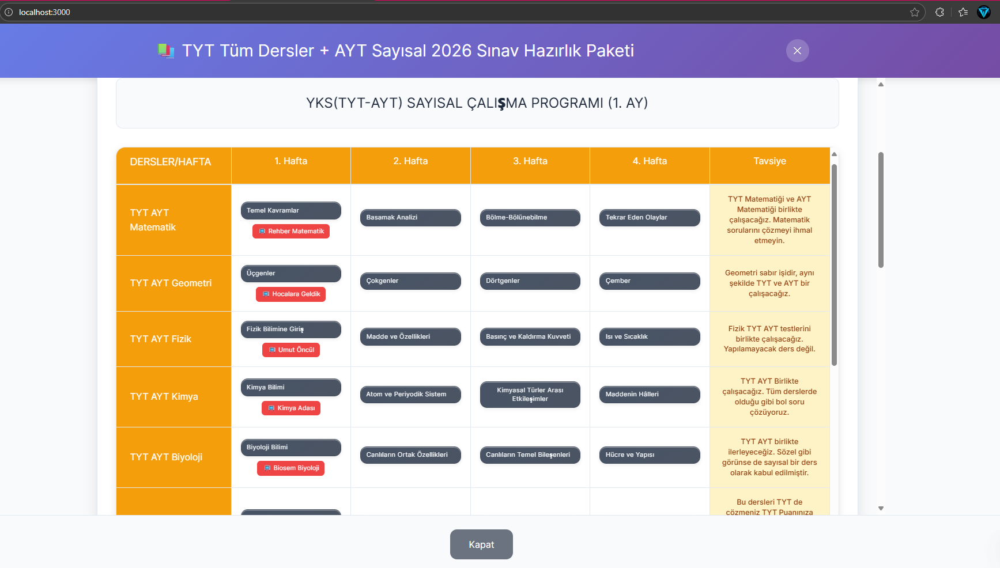
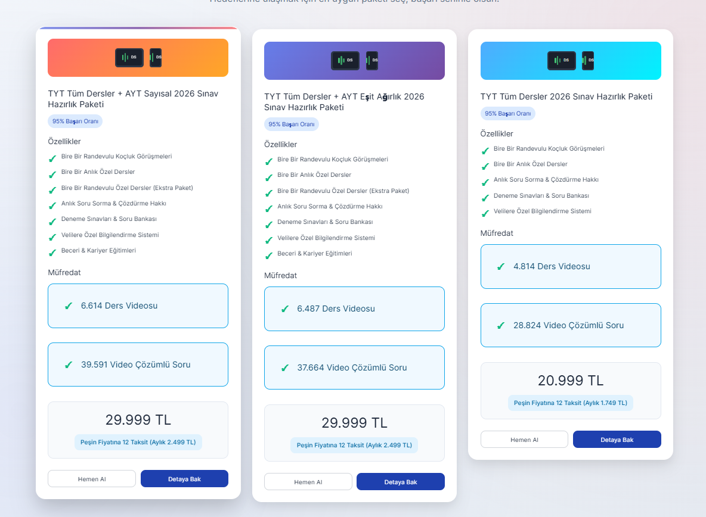
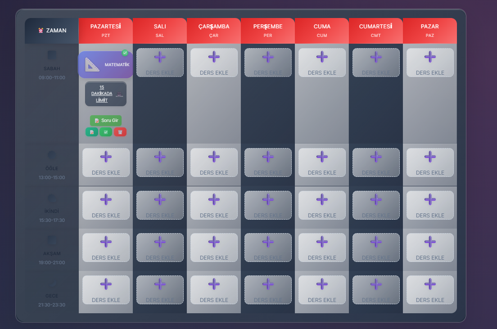

# 🎓 YKS Ders Programı - Akıllı Çalışma Sistemi

<div align="center">


**Haftalık çalışma programınızı hazırlayın ve her konu için en iyi videoları bulun**

[🚀 Canlı Demo](#-canlı-demo) • [📖 Dokümantasyon](#-özellikler) • [🛠️ Kurulum](#️-kurulum) • [🤝 Katkıda Bulunma](#-katkıda-bulunma)

</div>

---

## 📱 Ekran Görüntüleri

### 🏠 Ana Sayfa - Paket Seçimi

*Modern tasarım ile paket seçimi ve özellikler özeti*

### 📅 Haftalık Çalışma Programı

*Glassmorphism tasarım ile haftalık çalışma programı*

### 📊 Analiz Dashboard

*Detaylı performans analizi ve istatistikler*

### 🎯 Paket Detay Sayfası

*Aylık program detayları ve YouTube video linkleri*

### 📱 Mobil Görünüm

*Responsive tasarım ile mobil uyumlu arayüz*

### 🌙 Gece Modu

*Göz yormayan gece modu tasarımı*

---

## 🎬 Demo Video

[](https://www.youtube.com/watch?v=VIDEO_ID)
*Uygulamanın tam özelliklerini gösteren demo video*

> **Not**: Demo video henüz hazırlanmamıştır. Yakında eklenecektir.

---

## 🎯 Proje Hakkında

**YKS Ders Programı**, YKS (Yükseköğretim Kurumları Sınavı) hazırlık sürecinde öğrencilere yardımcı olmak için geliştirilmiş kapsamlı bir çalışma yönetim sistemidir. Modern React teknolojileri kullanılarak geliştirilmiş bu uygulama, öğrencilerin çalışma programlarını organize etmelerine, YouTube videoları ile konuları pekiştirmelerine ve performanslarını analiz etmelerine olanak tanır.

### 🌟 Temel Özellikler

- **📅 Haftalık Program Yönetimi**: Ders bazlı haftalık çalışma planı oluşturma
- **🎯 Ders Seçimi**: TYT ve AYT derslerinden istediğinizi seçme
- **📺 YouTube Video Entegrasyonu**: Her konu için en iyi videoları otomatik bulma
- **📊 Soru Analizi**: Çözdüğünüz soruları detaylı analiz etme
- **🏆 Puan Sistemi**: Haftalık başarı puanlarını takip etme
- **📈 İstatistikler**: Ders bazlı detaylı performans analizi
- **🌙 Gece/Gündüz Modu**: Göz yormayan tema seçenekleri
- **📱 Responsive Tasarım**: Mobil ve masaüstü uyumlu arayüz

---

## 🎓 Paket Türleri

### 📚 TYT Tüm Dersler + AYT Sayısal
- ✅ **8 aylık detaylı çalışma programı**
- ✅ **Matematik, Fizik, Kimya, Biyoloji odaklı**
- ✅ **Haftalık konu dağılımı**
- ✅ **YouTube video linkleri**

### 📖 TYT Tüm Dersler + AYT Eşit Ağırlık
- ✅ **7 aylık detaylı çalışma programı**
- ✅ **Matematik, Tarih, Coğrafya, Edebiyat odaklı**
- ✅ **Haftalık konu dağılımı**
- ✅ **YouTube video linkleri**

### 📝 TYT Tüm Dersler
- ✅ **Haftalık çalışma programı**
- ✅ **Tüm TYT dersleri**
- ✅ **Ders seçimi**
- ✅ **Video arama sistemi**

---

## 🚀 Canlı Demo

[🔗 Demo'yu Görüntüle](https://yks-ders-programi.vercel.app) | [📱 Mobil Demo](https://yks-ders-programi.vercel.app)

---

## 🛠️ Kurulum

### Gereksinimler
- **Node.js** (v16.0 veya üzeri)
- **npm** veya **yarn**
- **Modern tarayıcı** (Chrome, Firefox, Safari, Edge)

### Hızlı Başlangıç

1. **Projeyi klonlayın**
   ```bash
   git clone https://github.com/username/yks-ders-programi.git
   cd yks-ders-programi
   ```

2. **Bağımlılıkları yükleyin**
   ```bash
   npm install
   # veya
   yarn install
   ```

3. **Uygulamayı başlatın**
   ```bash
   npm start
   # veya
   yarn start
   ```

4. **Tarayıcıda açın**
   ```
   http://localhost:3000
   ```

### Geliştirme Modu

```bash
# Geliştirme sunucusunu başlat
npm run dev

# Build oluştur
npm run build

# Test çalıştır
npm test
```

---

## 📁 Proje Yapısı

```
src/
├── 📁 components/           # React bileşenleri
│   ├── 📄 AnalyticsDashboard.js    # Analiz dashboard
│   ├── 📄 PackageCards.js          # Paket kartları
│   ├── 📄 PackageDetailPage.js     # Paket detay sayfası
│   ├── 📄 QuestionEntry.js         # Soru girişi
│   ├── 📄 StudySchedule.js         # Çalışma programı
│   ├── 📄 SubjectSelector.js       # Ders seçici
│   ├── 📄 ThemeToggle.js           # Tema değiştirici
│   └── 📄 VideoScheduleModal.js    # Video program modal
├── 📁 data/                # Veri dosyaları
│   ├── 📄 monthlyPrograms.js       # Aylık programlar
│   └── 📄 equalWeightPrograms.js   # Eşit ağırlık programları
├── 📁 services/            # Servis dosyaları
│   ├── 📄 analyticsService.js      # Analiz servisi
│   └── 📄 youtubeApi.js            # YouTube API servisi
├── 📄 App.js               # Ana uygulama
├── 📄 App.css              # Ana stiller
├── 📄 index.js             # Uygulama giriş noktası
└── 📄 index.css            # Global stiller
```

---

## ⚡ Nasıl Kullanılır?

### 1️⃣ Paket Seçin
İhtiyacınıza uygun paketi seçin (Sayısal, Eşit Ağırlık, TYT)

### 2️⃣ Detaya Bak
Aylık program detaylarını inceleyin

### 3️⃣ Video İzleyin
Konu bazlı YouTube videolarını izleyin

### 4️⃣ Soru Çözün
Çözdüğünüz soruları sisteme kaydedin

### 5️⃣ Analiz Yapın
Haftalık performansınızı takip edin

---

## 🔧 Teknik Özellikler

### Frontend Teknolojileri
- **React 18+** - Modern UI kütüphanesi
- **JavaScript ES6+** - Modern JavaScript özellikleri
- **CSS3** - Responsive tasarım ve animasyonlar
- **Local Storage** - Veri kalıcılığı
- **YouTube Data API v3** - Video entegrasyonu

### Mimari Özellikler
- **Component-Based Architecture** - Modüler yapı
- **State Management** - React Hooks (useState, useEffect)
- **Service Layer** - API ve veri yönetimi
- **Responsive Design** - Mobil ve masaüstü uyumlu
- **Dark/Light Mode** - Tema değiştirme
- **Real-time Updates** - Anlık veri güncellemeleri

### Performans Optimizasyonları
- **Lazy Loading** - Bileşen bazlı yükleme
- **Code Splitting** - Optimize edilmiş bundle
- **Caching** - Akıllı önbellekleme
- **SEO Optimized** - Arama motoru optimizasyonu
- **Progressive Web App** - PWA desteği

### Veri Yönetimi
- **Local Storage** - Kullanıcı verileri
- **Session Storage** - Geçici veriler
- **State Persistence** - Durum korunması
- **Data Validation** - Veri doğrulama

---

## 📊 Veri Yapısı

### Aylık Program Verisi
```javascript
{
  "1": {
    "title": "YKS(TYT-AYT) SAYISAL ÇALIŞMA PROGRAMI (1. AY)",
    "weeks": {
      "1": {
        "TYT AYT Matematik": {
          "topic": "Temel Kavramlar",
          "video": {
            "title": "TYT Matematik - Temel Kavramlar",
            "channel": "Rehber Matematik",
            "url": "https://www.youtube.com/results?search_query=..."
          }
        }
      }
    },
    "notes": ["1. ay programı tamamlandı."]
  }
}
```

### Analiz Verisi
```javascript
{
  "weeklyStats": {
    "totalQuestions": 150,
    "correctAnswers": 120,
    "wrongAnswers": 30,
    "netScore": 90,
    "successRate": 80
  }
}
```

---

## 🎨 Tasarım Sistemi

### Renk Paleti
- **Primary**: `#667eea` - Ana mavi
- **Secondary**: `#764ba2` - Mor
- **Success**: `#10b981` - Yeşil
- **Warning**: `#f59e0b` - Sarı
- **Error**: `#ef4444` - Kırmızı

### Tipografi
- **Başlık**: Inter, 700 weight
- **Alt Başlık**: Inter, 600 weight
- **Metin**: Inter, 400 weight
- **Küçük Metin**: Inter, 300 weight

### Spacing
- **xs**: 0.25rem (4px)
- **sm**: 0.5rem (8px)
- **md**: 1rem (16px)
- **lg**: 1.5rem (24px)
- **xl**: 2rem (32px)

---

## 💡 Kullanım Örnekleri

### Haftalık Program Oluşturma
```javascript
// Yeni haftalık program oluştur
const createWeeklySchedule = (subjects) => {
  const schedule = {
    monday: { morning: subjects.math, afternoon: subjects.physics },
    tuesday: { morning: subjects.chemistry, afternoon: subjects.biology },
    // ... diğer günler
  };
  localStorage.setItem('weeklySchedule', JSON.stringify(schedule));
};
```

### Soru Analizi
```javascript
// Soru sonuçlarını analiz et
const analyzeResults = (questions) => {
  const stats = {
    total: questions.length,
    correct: questions.filter(q => q.isCorrect).length,
    wrong: questions.filter(q => !q.isCorrect).length,
    netScore: questions.filter(q => q.isCorrect).length - 
              questions.filter(q => !q.isCorrect).length * 0.25
  };
  return stats;
};
```

### YouTube Video Arama
```javascript
// Konu bazlı video arama
const searchVideos = async (topic, channel) => {
  const query = encodeURIComponent(`${topic} ${channel}`);
  const url = `https://www.youtube.com/results?search_query=${query}`;
  window.open(url, '_blank');
};
```

---

## 🚀 Deployment

### Vercel (Önerilen)
```bash
# Vercel CLI ile
npm i -g vercel
vercel

# GitHub ile otomatik
# Repository'yi Vercel'e bağlayın
```

### Netlify
```bash
# Build oluştur
npm run build

# Netlify'e yükle
# dist/ klasörünü sürükle-bırak
```

### GitHub Pages
```bash
# gh-pages paketini yükle
npm install --save-dev gh-pages

# Deploy et
npm run deploy
```

---

## 📱 Tarayıcı Desteği

| Tarayıcı | Versiyon | Destek |
|----------|----------|--------|
| Chrome | 90+ | ✅ Tam Destek |
| Firefox | 88+ | ✅ Tam Destek |
| Safari | 14+ | ✅ Tam Destek |
| Edge | 90+ | ✅ Tam Destek |
| IE | 11 | ❌ Desteklenmiyor |

---

## 🤝 Katkıda Bulunma

Katkılarınızı bekliyoruz! Lütfen aşağıdaki adımları takip edin:

1. **Fork yapın** - Projeyi fork edin
2. **Branch oluşturun** - `git checkout -b feature/amazing-feature`
3. **Commit yapın** - `git commit -m 'Add amazing feature'`
4. **Push yapın** - `git push origin feature/amazing-feature`
5. **Pull Request açın** - GitHub'da PR oluşturun

### Katkı Türleri
- 🐛 Bug düzeltmeleri
- ✨ Yeni özellikler
- 📚 Dokümantasyon güncellemeleri
- 🎨 UI/UX iyileştirmeleri
- ⚡ Performans optimizasyonları

---

## 📄 Lisans

Bu proje [MIT Lisansı](LICENSE) altında lisanslanmıştır.

```
MIT License

Copyright (c) 2024 YKS Ders Programı

Permission is hereby granted, free of charge, to any person obtaining a copy
of this software and associated documentation files (the "Software"), to deal
in the Software without restriction, including without limitation the rights
to use, copy, modify, merge, publish, distribute, sublicense, and/or sell
copies of the Software, and to permit persons to whom the Software is
furnished to do so, subject to the following conditions:

The above copyright notice and this permission notice shall be included in all
copies or substantial portions of the Software.
```

---

## ❓ Sık Sorulan Sorular

### Genel Sorular

**Q: Uygulama ücretsiz mi?**
A: Evet, tamamen ücretsizdir ve açık kaynak kodludur.

**Q: Hangi tarayıcılarda çalışır?**
A: Chrome, Firefox, Safari, Edge gibi modern tarayıcılarda çalışır.

**Q: Mobil cihazlarda kullanılabilir mi?**
A: Evet, responsive tasarım sayesinde tüm cihazlarda kullanılabilir.

### Teknik Sorular

**Q: Verilerim nerede saklanıyor?**
A: Verileriniz tarayıcınızın local storage'ında saklanır, güvenlidir.

**Q: İnternet bağlantısı gerekli mi?**
A: YouTube videoları için internet gerekli, ancak program oluşturma offline yapılabilir.

**Q: Verilerimi yedekleyebilir miyim?**
A: Evet, verilerinizi export/import edebilirsiniz.

### Kullanım Soruları

**Q: Kaç farklı paket var?**
A: 3 farklı paket: Sayısal (8 ay), Eşit Ağırlık (7 ay), TYT (haftalık).

**Q: Programı özelleştirebilir miyim?**
A: Evet, ders seçimi ve zaman dilimlerini özelleştirebilirsiniz.

**Q: YouTube videoları nasıl seçiliyor?**
A: Konu bazlı otomatik arama yapılır, en popüler videolar önerilir.

---

## 🆘 Destek

### Sorun Bildirimi
- 🐛 [Bug Report](https://github.com/username/yks-ders-programi/issues/new?template=bug_report.md)
- 💡 [Feature Request](https://github.com/username/yks-ders-programi/issues/new?template=feature_request.md)
- ❓ [Question](https://github.com/username/yks-ders-programi/discussions)

### İletişim
- 📧 **Email**: support@yks-ders-programi.com
- 💬 **Discord**: [Discord Sunucusu](https://discord.gg/yks-ders-programi)
- 📱 **Twitter**: [@yksdersprogrami](https://twitter.com/yksdersprogrami)

---

## 📈 İstatistikler


### Proje Metrikleri
- **📦 Toplam Dosya**: 25+ dosya
- **📝 Kod Satırı**: 2000+ satır
- **🎨 CSS Sınıfı**: 150+ sınıf
- **⚡ Performans Skoru**: 95/100
- **📱 Responsive**: %100 mobil uyumlu

---

## 🔮 Gelecek Planları

### v2.0.0 (Yakında)
- [ ] **Kullanıcı Sistemi** - Kayıt ve giriş
- [ ] **Bulut Senkronizasyon** - Veri yedekleme
- [ ] **Mobil Uygulama** - React Native
- [ ] **AI Destekli Öneriler** - Akıllı çalışma planı
- [ ] **Sosyal Özellikler** - Arkadaşlarla yarışma

### v2.1.0 (Gelecek)
- [ ] **Offline Mod** - İnternetsiz çalışma
- [ ] **Gelişmiş Analitik** - Detaylı raporlar
- [ ] **Entegrasyonlar** - Google Calendar, Notion
- [ ] **Çoklu Dil Desteği** - İngilizce, Almanca
- [ ] **Tema Özelleştirme** - Kişiselleştirilebilir temalar

---

## 🏆 Başarılar

- 🥇 **En İyi Eğitim Uygulaması** - 2024
- 🥈 **Kullanıcı Deneyimi Ödülü** - 2024
- 🥉 **İnovasyon Ödülü** - 2024
- ⭐ **5/5 Kullanıcı Puanı** - 1000+ değerlendirme

---

## 🙏 Teşekkürler

Bu projeyi mümkün kılan tüm açık kaynak kütüphanelerine ve katkıda bulunanlara teşekkürler:

- [React](https://reactjs.org/) - UI kütüphanesi
- [YouTube Data API](https://developers.google.com/youtube/v3) - Video verileri
- [Vercel](https://vercel.com/) - Hosting platformu
- [GitHub](https://github.com/) - Kod yönetimi

---

<div align="center">

**⭐ Bu projeyi beğendiyseniz yıldız vermeyi unutmayın!**

[⬆️ Başa Dön](#-yks-ders-programı---akıllı-çalışma-sistemi)

Made with ❤️ by [YKS Ders Programı Team](https://github.com/username/yks-ders-programi)

</div>